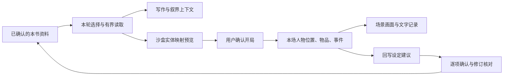

# 本书资料库重设计方案

日期：2026-10-06。状态：可审阅建议稿，尚未实施，阶段卡只供后续派工。

配套桌面前端原型：`D:/Narraverse2.0/artifacts/book-library-preview-20261006/index.html`，本机预览 `http://127.0.0.1:18309/`。使用虚构资料展示页面与交互；不代表生产重构、R0 契约或各阶段已验收。

用户已确认该桌面界面方向。第一期派工以 `D:/Narraverse2.0/docs/交付/本书资料工作台-第一期实施任务书-2026-10-06.md` 为准：真实接入当前书、主次人物、现有图谱与编辑能力；不扩 schema，不执行 R2—R5。本轮仅编制任务书，业务实施尚未开始。

用户要求：参照 Worldset Studio 重新规划资料库，允许大改。沿用已明确偏好：电脑端优先、图片采用大图轮播、模型使用共享 Settings、实现优先分派给其它 AI。

## 1. 目标与范围

把本书资料库升级为创作者可以长期使用的资料工作台。用户可以方便地回答：这本书里有哪些人和地方，他们有什么联系，发生过什么，以及本轮写作或游戏具体用了哪些资料。

三个结果：

1. 阅读时可以浏览人物卡、地点层级和关系，不必逐条进入表单才能认识世界。
2. 创作时可以补正文、图集、档案和关联；少量资料也能直接使用，不强迫填满模板。
3. 写作、叙界和沙盒通过明确入口使用同一份已确认资料；本场剧情进展与原始设定分开。

本方案的主对象是当前书籍 Lore，不把独立作品设定库、Master 总资料库与本书 Lore 在磁盘上合并。已有 `LIBRARY_EVOLUTION_BLUEPRINT.md` 描述的是另一条存储与模式接入路线，本方案不替代其 L1—L4 契约。先统一用户的理解和取材入口，跨库迁移须另行盘点。

书籍总览继续保留，作为资料库中的一篇可编辑概述。资料库首页、总览正文和关系图分别承担不同工作。

## 2. 当前源码事实

本次核对的工作树：`D:/Narraverse2.0-platform-model`，分支 `codex/platform-model-unification`，HEAD `95acac709bbb269e5612467712886022266160bd`，存在未提交改动。以下是当前工作树源码事实，不是正式运行版验收结论。

| 已有能力 | 证据与设计含义 |
| --- | --- |
| 分类目录、搜索、加载策略、主次人物分组 | `SettingPanel.tsx`、`knowledge-sections.ts`；可以复用查询逻辑和已有分组，不重新生成这些资料。 |
| Markdown、摘要、图片上传与大图轮播 | `LoreEditor.tsx`、`LoreImageGallery.tsx`；作为新详情页基础，保留用户已认可的图片体验。 |
| 总览阅读、编辑、AI 草稿、关系图 | `BookOverviewPanel.tsx` 中 read/graph/edit；图谱目前从总览内部进入，适合提升为资料库独立视图。 |
| 图谱类型/人物层级筛选、关系筛选、一二度聚焦 | `BookGraphView.tsx`；已有实现需要接入新入口，不能作为从零新增功能重复派工。 |
| 条目稳定 ID、来源、多图、关系 | `internal/book/lore.go`；缺少本方案拟新增的分类档案与事件字段。 |
| 显式关系及原子写入 | `lore_relations.go`；当前关系为目标 ID、文字名称、备注，不能直接把任意名称当成可执行的地点归属或移动规则。 |
| 修订冲突与原子保存 | `LoreItemInput.BaseRevision` 与 LoreStore 保存机制；不能据此声称已经有用户可恢复的逐条修改历史。 |

同时存在旧的按名称表达的引用路径，例如 `lore_references.go` 处理的 `[[名称]]`。新结构关联按 ID 保存，但旧引用的兼容需在实施前盘点，不能只改界面而破坏现有游戏或工具读取。

## 3. 路线选择

| 路线 | 最有力的理由 | 主要代价 | 判断 |
| --- | --- | --- | --- |
| 在现有目录上增加卡片与筛选 | 交付快、保存和调用风险较小，近期即可改善阅读 | 地点、事件和关系仍缺少统一结构；大组件继续增长 | 适合作为第一步，不能覆盖完整目标 |
| 重做资料工作台，渐进扩展现有 Lore | UI 可以大改，同时沿用书籍身份、资料 ID、图集和模型入口；每阶段能交付 | 需要先明确档案、关系和事件的单一写入责任 | **推荐** |
| 一次重写全部库并统一数据库、游戏存档 | 长期概念可以统一，消除多套历史入口 | 当前多个库有不同原件、授权与运行态语义；迁移和回归范围最大，无法快速确认体验 | 暂不选择 |

允许大的产品改动，用分段交付控制数据风险。先改善可感知的使用过程，再按需要扩大底层变化。

## 4. 桌面信息架构

### 与参考网站逐项对应

以用户指定的 Worldset Studio 为主要产品参照，以下区别是本项目的设计选择，不代表对方内部架构。

| 参考网站已读到的内容 | 本项目采用方式 | 调整原因 |
| --- | --- | --- |
| 仪表盘的最近编辑、待补全、总览与关系/事件预览 | 工作台保留继续编辑、置顶、待处理和总览入口 | 用户先找到下一步工作；不把完整度分数当创作质量 |
| 全部条目表格中的分类、标签、状态、关系与更新时间 | 全部资料提供列表/卡片和批量选择，保留信息密度 | 资料多时便于整理，人物浏览时又能使用图片 |
| 人物卡与可选择的卡片字段 | 人物页使用图像与少量关键字段，点开完整档案 | 延续用户已认可的大图体验，避免信息全部藏在编辑器 |
| 详情中的结构档案、摘要、正文、关系、事件与历史 | 采用相同的分区阅读思路，空分区不占位 | 既能快速看人，也能写较长设定 |
| 地点页的层级列表、控制势力和风险信息 | 第一版实现地点层级；控制势力来自明确关系，风险信息可选 | 参考页的地图标为占位，不能当作成熟可玩地图直接接入 |
| 图谱分类过滤、局部聚焦和节点详情 | 把本项目现有图谱提升到独立入口，补齐统一详情导航 | 复用已有能力，把改动投入入口和使用连续性 |
| 首页时间线预览、条目事件与站内公告中的世界时间线设置 | 规划世界事件与人物/地点事件共用来源 | 此轮完整时间线页面未成功读出，只以这些可见内容为参考 |
| 检查页明确区分存疑、提示与规则检查 | 建立可跳转到条目的待核对清单，显示触发依据 | 事实不足只提示，不自动纠正作者设定 |

参考网站的编辑与保存没有实测；布局建议来自读到的页面结构，精确视觉尺寸和交互手感需要在 R0 桌面线框阶段继续对照。

平台接入口建议沿用左侧一级“资料库”，在现有“作品设定库 / 公共素材”上增加“本书资料”分区。有当前书籍时默认进入本书工作台；无当前书籍时本书分区提示选择书籍，独立作品设定库仍可正常使用。当前 `LibraryWorkspaceRoute.tsx` 的 mine/public 两分区及未保存草稿确认需要保留，不合并它们的存储。后续由该路由集成本书工作台，入口由 `WorkbenchShell.tsx` 的资料库按钮进入；写作、叙界和游戏原有资料快捷入口打开同一份本书工作台，并恢复选中条目。切换资料视图不切换写作或游戏模式。本段是正式接入建议，此轮只更新独立原型。

2026-10-06 原型调整：关系页直接打包复用当前工作树的 `BookGraphView.tsx` 及其控制、布局模块，展示自动布局 Canvas 图谱，不再手写固定节点坐标 SVG。资料与关系更新后由现有组件重新计算布局；不需要每次调用 AI 绘图。人物页复用 `character_tier` 的 major/minor/unclassified 分类，默认只看主要人物；次要人物使用紧凑列表，未分类单列，每页最多 12 位。新条目缺失层级时进入未分类，不按名称或模型猜主次；分类本身不改变加载策略或重要性。

```text
本书资料库                  当前书籍 ▾    搜索本书资料    新建 ▾    导入
│
├─ 工作台                   最近编辑 / 置顶资料 / 待处理建议 / 总览摘要
├─ 全部资料                 列表 ↔ 卡片；按类型、标签、状态筛选
├─ 人物                     主要人物卡 / 次要人物紧凑列表 / 未分类；分组分页
├─ 地点                     层级目录 + 地点详情；后续增加连接示意
├─ 势力                     势力资料与成员、据点入口
├─ 物品与生物               按类型筛选；资料模板渐进提供
├─ 世界与规则               世界背景、规则、文化、能力体系等
├─ 关系图                   同一批条目的关系投影，默认聚焦局部
├─ 时间线                   世界事件，可切换到某人物或地点
└─ 更多                     书籍总览 / 灵感 / 待整理 / 管理
```

这是最终目标导航。阶段未实现时不展示空壳入口。工作台保留明显的“打开书籍总览”，也允许用户置顶该入口；老用户默认恢复上次视图及选中条目。

工作台首先帮助继续工作：最近编辑、置顶人物或地点、待接受的 AI 建议、可选的缺失信息检查。条目数量作为辅助信息，不让分数、统计和装饰图占据主要空间。

### 页面结构

- 浏览：左侧导航，中间卡片或列表，选中后右侧摘要抽屉；双击或“打开档案”进入完整详情。
- 编辑：左侧可收起目录，中间宽正文，右侧按需打开关联或 AI 建议。避免同时堆四栏。
- 关系与地点图：主区域给画布，右侧只展示所选对象；从关系进入详情后可以返回原筛选、焦点与缩放。
- 主操作使用“添加图片”“添加关系”“用于本轮”等文字，关键入口不能只剩不易发现的图标。
- 仅验收电脑窗口（1366×768、1440×900、1920×1080）；窄一些的电脑窗口允许收起右栏。中英双语、深浅主题、键盘操作、长标题和空数据一并考虑。

## 5. 条目体验与资料模型

### 5.1 一个条目，一套详情

详情页包含：名称与一句话简介、图集、档案、正文、关联、相关事件、来源与历史。内容少时隐藏空分区，进入编辑可以补充。

- 人物卡显示大头图或清晰后备标识、姓名、叙事层级，以及用户选出的两三个信息字段。主要人物/次要人物属于展示分组，不改变 AI 加载优先级。
- 图集沿用大图轮播、本地多图上传与 AI 生图；新增封面选择和排序时独立落字段，移除关联保留现有物理文件语义。
- 常规编辑保留自动保存、明确的保存中/已保存/冲突提示。切条目先处理未保存草稿；保存失败时不丢正文。
- AI 操作打开建议区，可逐项接受。晚到结果留在所属书籍与条目的草稿中，不能覆盖用户后续编辑。

### 5.2 少量公共字段，加按类档案

公共字段沿用 ID、名称、类型、简介、正文、标签、图集、来源、修订；拟增加别名与编辑状态。人物、地点等仅添加对浏览、关联和取材确有价值的可选档案。

| 类型 | 首批可选字段 | 应由关联派生的内容 |
| --- | --- | --- |
| 人物 | 职业、种族、目标、动机、弱点；年龄先允许文本 | 所属势力、故乡、固定居所、重要人物关系 |
| 地点 | 地点种类、简要环境、规则或进入条件的说明 | 上级地点、控制势力、已确认连接 |
| 势力 | 宗旨、组织性质 | 成员、据点、敌友势力 |
| 物品 | 种类、用途、使用条件说明 | 设定中的归属、关联地点与人物 |
| 生物 | 种类、习性 | 栖息地点、相关种族或势力 |
| 世界与规则 | 适用范围、例外说明 | 相关人物、地点、物品 |

“编辑状态”（草稿/已确认/待修订）、“模型加载方式”和“角色存活状态”必须是不同概念。生存状况、年龄与持有者有时间语境；资料页默认表示设定基准，游戏实例中的当前值另存。

空字段表示未填写，不表示“没有”；未知信息不自动补成事实。不把整篇正文强制拆表，也不同时做任意数据库字段设计器。后续题材模板首先复用字段与关系定义。

### 5.3 关联是共享事实

推荐扩展现有 Lore 关系能力，而非让人物、地点、谱系各存一套关系。一般关系保留用户自定义名称；需要机器理解的关系增加明确的语义类型，例如所属势力、地点包含、地点连接。具体版本化 DTO 在 R0 冻结。

- 字段“所属势力”与关系图同一条关系，编辑任一入口只调用同一写入服务。
- 地点层级采用一条主要包含关系，禁止自包含和循环；有争议的归属以普通关联补充，不挤进层级树。
- 地点连接与包含独立；相邻、位于某地并不直接等于允许玩家通行。
- “朋友”和“敌对”不一定对称；两端不同视角须明确展示，不能自动倒推。
- 旧关系文字默认作为普通关联保留，不凭“位于”两个字静默迁成层级事实。
- 正文提到某条目只产生引用线索，与用户确认的关系区分。未解析/同名目标交给用户选定 ID。
- 第一版不增加独立谱系存储。未来谱系只是同一批亲属关系的另一种呈现。

## 6. 时间线、历史与灵感

三个容易混淆的概念分别处理：

1. **世界事件**：作者确认的故事设定，如“某年城堡失守”。人物与地点页按参与者、发生地筛选同一批事件，不复制成多套时间线。
2. **修改历史**：资料被编辑前后的版本，用于比较和恢复。恢复产生新版本，并保留恢复前状态。与 revision 冲突检测不同。
3. **本场日志**：沙盒或叙界中实际发生的行动和变化，归属于特定存档，默认不会进入全书世界事件。

首批事件支持标题、摘要、涉及条目、日期原文与可选明确排序值。日期未知时放“时间未定”，禁止把不完整年份补齐成某月某日；自定义纪元、历法换算、时间树后置。

灵感允许只写一句话。转为正式条目时预览拆分与关联，确认才入库；同一次采用不能生成重复条目。为降低首期范围，灵感管理在阅读/编辑核心完成后实施。

## 7. AI 与各模式使用资料

AI 整理围绕当前任务提供四类建议：从选中文字提取档案、推荐关系、指出待核对矛盾、整理总览。支持已有内容整理，也允许用户明确要求补设定；后者标成创作建议，不能冒充原文事实。

建议记录来源条目、版本、原文依据与拟修改字段，逐项接受；批量采用前显示具体范围并重新核对修订。确定性的缺字段、悬空关联或层级环检查走本地规则，无需每次浏览调用模型。

检查必须考虑时间与题材。例如“当前已死亡的人参与历史事件”本身并不矛盾；没有死亡时间就不能判定因果冲突。地点由敌对势力共同控制可能是争夺状态。缺乏足够依据时仅列待核对，并允许附理由忽略，不要求作者为了消除提示添加无意义标签。

模型上下文沿用总览、已启用常驻资料、本轮选择与现有网关。页面新增的“相关条目”不自动取得读取或注入权限。展示本轮使用的来源、版本、遗漏与实际可取得的用量；不承诺所有调用都能估算精确费用，不发送整库正文。预算沿用现有约定，需改时在契约中明确。



沙盒使用资料必须经历实体映射：选择人物、地点、物品，补全本场必要信息后创建实例。库内 ID 与本场实体 ID 分开，并记录来源版本。来源后来变动时提示差异，由用户决定如何应用到本场；不静默重置玩家位置或背包。

可视化与文字读取同一批已提交事件。操作失败不伪造成功日志；AI 补充描写不能重新执行取物、扣资源或移动。本方案不把现有火柴人独立试玩当作已完成正式接入。

## 8. 实施结构与数据保护

- 从 `SettingPanel.tsx` 逐步抽出独立的本书资料工作台，建议放到职责明确的 `features/book-library/`；配置/创作偏好等保留其原有职责。旧入口最后切换，不一次把整个 SettingPanel 重写。
- 列表、卡片、图谱、地点层级、时间线共用本书查询与条目详情能力。不要为每个视图复制保存逻辑、模型调用或一套条目缓存。
- 后端延续本书所有权与 LoreStore 服务边界，按职责拆分字段校验、关系校验和读取投影。JSON 文件或更大存储调整在 R0 根据实际读写量决定；默认先扩展版本化 Lore 数据，不引入新数据库作为前置条件。
- 新 schema 在副本上演练升级；保留 ID、正文、图片路径、关系原文、来源与加载方式。旧正文不自动 AI 重写。
- 新字段必须覆盖普通编辑、批量工具、导入和所有写入者的往返保存；旧写入者无法保真时拒绝写入并给出升级提示，不能静默抹掉字段。
- 明确检测较新 schema，旧程序不可降级写回。迁移备份需覆盖同一一致性边界，回退代码须同时恢复对应数据副本。
- 不按名称合并重名资料、不删除原图、不扫描整库用户文件做测试。跨书请求、选择、图谱焦点和 AI 草稿按书籍身份隔离，保留 A→B→A 迟到响应反例。
- 本次不启停服务、不迁移运行数据。未来发布单独核对目标 exe、前端、数据与工作区，避免把预览产物误装到正式实例。

## 9. 分阶段任务卡

这些是建议任务包，不表示已派发或可脱离 R0 契约直接编码。每包接手时必须记录工作目录、分支、基准 SHA、已有改动归属和禁止触碰范围。

| 阶段 / 卡 | 明确产出与边界 | 完成标准 |
| --- | --- | --- |
| R0：边界与契约 | 盘点当前所有 Lore 写入/读取者；冻结档案、关联、事件身份与修订语义；确定增量 schema 与迁移演练；给桌面关键页低成本线框 | 用两人物、两地点、一势力、一物品说明各字段由谁写；同一关系没有双写源；确认新旧引用兼容与阶段依赖 |
| R1：资料工作台与条目阅读 | 抽出独立入口；工作台、全部资料、人物卡、详情、搜索、返回位置恢复；接现有图片/编辑/总览 | 新建与编辑→保存→刷新仍在；已有多图、主次人物、关系和加载模式保留；切书不串；从卡片可直接进入档案 |
| R2：档案与地点关系 | 版本化可选档案、语义关系、单一关系编辑服务；人物势力关联、地点层级；迁移与回滚证据 | 改所属势力同时反映到人物和势力；改地点归属后树与详情一致；循环与过期写拒绝；旧文本关系不被猜改 |
| R3：关系探索与事件 | 现有图谱独立入口；统一详情跳转；世界事件与人物/地点时间线；逐条修改历史 | 图、列表、详情看到相同关系；同一事件修改只更新一份；历史恢复能撤回且刷新保留；未知日期处理明确 |
| R4：AI 整理与取材 | 选区/条目结构化建议、关系建议、确定性检查、来源差异、上下文取材面板；灵感转条目 | AI 提案不自动落盘；晚到、过期、越界建议不能覆盖；模型实际装配输入与所选条目对应；计量只报真实可得值 |
| R5：沙盒消费闭环 | 对接已有 Module4 重构方案的 S1—S3，复用行动与渲染方案；选择资料→映射预览→实例化→本场状态/文字/场景同步 | 一场“选人物与地点→取钥匙→开门→移动→看日志→刷新继续”真实链；原始资料不被本场变化改写；失败零误提交 |

R5 不另起第二套沙盒引擎；与 `MODULE4_SANDBOX_REBUILD_DRAFT_2026-10-05.md` 的导入、行动和存档任务合并排期。R1 可先交付可用版；R2 契约冻结后，沙盒映射设计可提前进行，不必等待 R4 所有增强功能。

建议派工方式：A 负责 R0、所有权与迁移取舍；性价比编码 AI 负责已冻结契约下的卡片、列表、详情拆分、翻译接线及定向回归；关系一致性、迁移与事务交由适合复杂推理的实现者。Luna 可承担独立的定向复核。阶段门禁通过后停止重复加测。

同一工作树不并行修改生产代码；若并行，使用各自隔离工作树。路由、公共 DTO、共享 i18n 注册、集成入口与日志由集成者统一修改。绘制组件素材任务可以独立推进，不占用资料库实现者。

## 10. 验证与近期取舍

测试只围绕实际改变的边界：纯模型/校验用快速单测，持久化与权限用集成测试，桌面操作用真实浏览器。固定桩与真实模型分别报告；仅看到页面或构造 prompt 不算模式接入验收。每阶段提供一条完整正常链及对应失败反例。

列表、图片和图谱使用虚构小库及中等规模样本检查交互流畅度。先记录渲染、搜索与打开条目的实测基线，再据瓶颈决定分页或索引；不为未知规模提前换数据库。

近期暂不做：手机适配、像素头像生成、全自动 NPC 后台模拟、全平台库合并、多人协作、地图编辑器、完整历法、独立谱系编辑器、向量库与自动整库召回。地图第一步是地点层级与已确认连接示意，图上距离不自动成为游戏规则。

建议先交付 R0＋R1，让用户直接比较新资料工作台是否更好用，再按 R2→R3 推进资料结构。R4、R5按实际创作与游玩需求接入，不把全部规划打成一个大任务。

## 11. 参考与结论边界

参考页面已读取仪表盘、全部条目、人物、地点、关系图、人物详情与检查页内容。完整时间线页本轮只返回页脚，时间线参考限于首页预览、条目事件区与站内公告。未实测对方保存/编辑功能，也没有获取其实现代码。

- [Worldset Studio 仪表盘](https://myworldstudio.cn/p/prj_ashes)
- [人物](https://myworldstudio.cn/p/prj_ashes/characters)
- [地点](https://myworldstudio.cn/p/prj_ashes/locations)
- [图谱](https://myworldstudio.cn/p/prj_ashes/graph)
- [条目详情](https://myworldstudio.cn/p/prj_ashes/entries/en_ilsa)
- [全部条目](https://myworldstudio.cn/p/prj_ashes/entries)
- [设定检查](https://myworldstudio.cn/p/prj_ashes/checks)

参考其类型化浏览、档案和关系组织思路；不照搬示例文本、图片或未知实现。它的条目页提示亲属关系与普通关联不是自动同步的，本方案选择统一关联来源，避免后续维护两套事实。

本轮仅规划与源码盘点；没有实现新功能，没有执行测试或重新验收已有功能，没有迁移用户资料，也没有提交、推送或部署。
