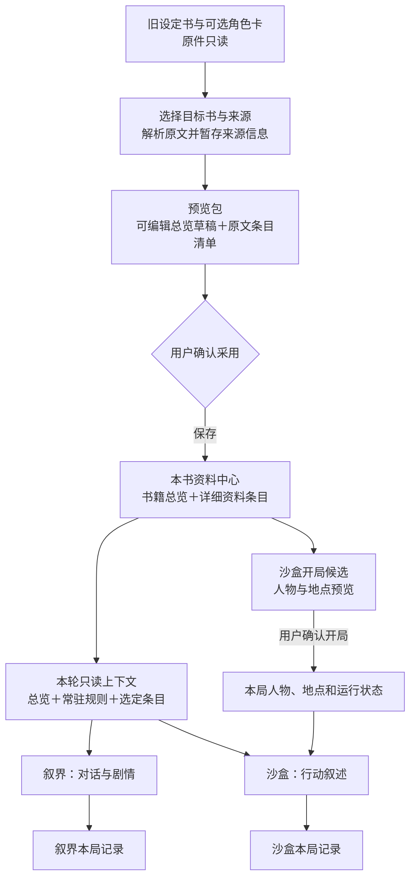

# 旧设定书 → 书籍总览与资料 → 叙界 / 沙盒：数据流设计

版本：v0.7，2026-10-06（Asia/Shanghai，范围收回本书资料接入）。
状态：书架「和 AI 一起构思」入口仍移除，底层草稿 API 保留；模块三保留现有 UI 与冒险玩法，仅继续本书资料读取；叙界和开放沙盒补同一现有本书资料库入口，模块四生成逻辑保持现状。\
定位：沿用现有书籍资料体系，将旧叙界设定书变成建书/补充本书资料的来源。上一期 P1 没有覆盖这一来源导入流程，本设计是后续扩展。

**历史范围纠正**：用户于 2026-10-06 明确只去掉构思入口，不撤销 API，也不改当时的模块三/四接入。上一轮移除服务接入的处理已纠正；普通新建书籍、资料库和已有数据保留。第 14—16 节及第 19 节包含的旧书架入口方案仅供追溯，不能据此重新加回入口。模块三的 B 阶段读取调整当时未做；现行规划以下面的范围更新为准。

**后续范围更新（2026-10-06）**：用户进一步要求模块三读当前书籍资料，并把页面改为头像与对话气泡的聊天格式；切书即可换冒险。模块三第 17 节由 [模块三本书聊天重设计](MODULE3_BOOK_CHAT_REDESIGN_2026-10-06.md) 接替，首版拟含确定性关键词触发与本书多聊天保存。旧素材确认采用和运行态不回写 Lore 的原则保留；模块四及已取消的构思入口不扩展。新文档为可审阅方案，不能据此宣称已经接通或部署。

**现行范围（同日后续更正，优先于上段）**：用户明确「模块3暂时够用了，不对它大改」。聊天气泡/新 React 聊天域/新存储/自动召回方案全部暂缓，第 17 节本书资料主线恢复为当前依据。仅复用现有 SettingPanel 在叙界和开放沙盒打开本书资料，模块三通过受控宿主读取总览＋常驻＋显式选定正文；模块四本轮只补资料入口，不改变其 world/library 模型输入。现有浏览器冒险增加书籍归属防串保护，不建设第二套聊天服务、不自动迁移旧存档；既有作品设定库/公共素材与本书 Lore 保持分离。

**本轮源码交付（2026-10-06 16:28）**：上述窄范围已在正式维护树完成，Go 定向/构建、前端 40 项、类型、i18n 通过；当前整合版隔离 Edge + 本机上游桩完成 9 项真实页面/HTTP 检查，真实模型未验。未提交、推送或部署，8084 原服务未替换。完整记录在 `D:/Narraverse2.0-platform-model/denova-src/artifacts/book-lore-module3-20261006/README.md`；本段不代表旧素材迁移、自动召回或全部历史阶段 B 的任务已完成。

**后续本机部署（2026-10-06）**：用户明确授权更新8084，已替换原发布程序与前端，当前PID31108，数据目录和《水浒传》保留；正式页面只读烟雾通过，正常授权流程重新打开系统浏览器。其它端口、源码Git状态不变。详见上述交付记录末尾与 deploy-8084 回执；未将固定桩证据称作正式模型复验。

**关键词增量（同日后续）**：用户明确要求子代理加入宏值/关键词按需触发，并保留手选。现已实现并更新8084（PID91932）：现有宏值与近14条对话、只匹配auto条目名称/Keywords，resident＋显选优先并去重；无系统模板/正文递归触发，不影响模块四。原“首版不做自动召回”的边界在本增量改为允许确定性关键词触发，语义搜索/递归/模型检索与聊天重构仍未做。证据 `D:/Narraverse2.0-platform-model/denova-src/artifacts/book-lore-keywords-20261006/README.md`，50前端与11项桩上游浏览器通过，未验真实模型质量、未Git提交/推送。

## 1. 推荐方向

用户流程是：**选旧设定书 → 先看并编辑总览 → 确认采用 → 本书资料可用 → 进入叙界或沙盒**。

数据上同时保留两条输出：**概括内容写入书籍总览，原始详细设定进入本书条目**。不能只留一份 AI 摘要，也不能让 AI 从摘要重新编造人物、地点、规则。

旧设定库负责提供素材，本书资料是采用后的编辑位置，各模式保存自己的游玩状态。三者用途不同，不随剧情自动互相覆盖。

## 2. 总体数据流



图中没有“剧情自动写回设定”的箭头。沙盒需额外创建可操作对象；模型知道某地点，并不等于地图已有该地点。

## 3. 各层负责什么

| 层 | 内容与归属 | 写入时机 |
| --- | --- | --- |
| 旧素材来源 | 叙界旧设定书、已有总资料库设定素材、用户明确选中的角色卡 | 本流程只读原件 |
| 来源预览包（待补） | 来源与版本、完整条目候选、总览草稿、冲突与缺失提示；绑定目标书 | 仅临时草稿，取消不改变本书内容 |
| 书籍总览（已有） | `setting/book-overview.md`；世界概况、核心规则、人物/地点索引 | 用户确认后通过既有 revision 保存 |
| 本书资料（已有） | 书籍工作区 `.denova/lore/items.json`；人物、地点、势力、规则等详细正文及来源关联 | 用户确认采用的条目落库；以后在本书编辑 |
| 本轮生成上下文（已有基础） | 从同一本书读取总览、常驻与选定条目；核对书籍归属及资料版本 | 按请求临时装配，不成为第二份可编辑资料库 |
| 模式运行状态（已有各自存储） | 叙界会话；沙盒本局 NPC、地点、事件、玩家状态与日志 | 通过各模式既有保存/规则流程写入 |

“本书资料中心”是对现有总览和 Lore 的统一使用方式，不新建第三套资料存储。原素材的来源身份和当前书籍身份也不能互相代替。

## 4. 用户实际会怎么使用

### 第一步：从旧设定开始

建议入口名为“用已有设定整理本书”，既可从旧设定书入口发起，也可从书籍总览页发起，最终进入同一流程。

先显示目标书籍；没有书籍时先选择或创建，再继续。第一版建议一次采用一个设定书，可附带用户勾选的角色卡，避免一开始就承担多世界自动合并。

旧冒险已保存的 backgroundBooks 与书库原素材可能不同。界面应明确选的是“书库原件”还是“本次冒险中的副本”，只读取用户选择的版本，不扫描或迁移全部旧存档。

### 第二步：先整理总览，同时保留原条目

系统解析选中来源，按原条目保留正文及来源信息；结构不明确的原文可暂列“待分类”，不能擅自删掉。AI 以这些内容为依据生成总览草稿，可手工编辑，也可不用 AI、手动写总览。

同一预览中展示两块内容：

- 总览：这本书讲什么世界、有哪些核心约束、主要人物与地点。
- 将加入的资料：原文条目、分类、来源、常驻/手动选择建议，以及同名冲突和待补项。

总览是摘要，不替代原文。模型输出中的“待补/矛盾”保持可见；来源没有说明的关系、数值、地图边不能自动认定为事实。原设定书包含的角色扮演提示词应当作来源内容处理，不能提升为宿主指令。

现有“AI 整理总览”只接收已存 Lore 的 ID，不能直接完成这个预览。需要补一个来源准备适配，让尚未确认入库的条目候选参与整理；读取、预算、书籍归属均在受控服务端完成，不能让客户端随意指定磁盘路径。

### 第三步：确认采用，写入同一本书

点击“采用到本书”前列出本次会新增/更新的总览和条目。已有总览默认保留用户编辑；同名条目显示对照，由用户选择保留、合并或另存，不能仅凭名称相同就覆盖。

确认操作绑定目标书籍与基准 revision，并记录来源版本及来源条目→本书条目映射。重复点击或重试不重复建条目。尽量复用现有素材导入、来源记录、幂等和 revision 保存能力。

总览和条目目前属于不同文件，不假装一次写入天然具有跨文件原子性。实施时需明确提交回执：只有两侧都完成才显示“采用完成”；若部分成功，标出已完成部分并支持恢复/重试，不能悄悄放行使用或覆盖用户后续修改。

确认前切换书籍、来源版本变化或本书资料被修改时，重新核对并展示差异；旧预览不得落到新书。

## 5. 进入叙界与沙盒

### 共用：同一本书，同一资料来源

进入模式时明确显示“当前使用《某书》资料”。绑定同一书籍与资料版本，每轮装配：

1. 已保存的总览：稳定概况。
2. 已启用的常驻规则：用户确认必须持续遵守的内容。
3. 本轮选定条目：人物、地点及相关详细事实。
4. 当前模式自己的历史与状态：独立于静态资料。

第一版沿用已实现的显式条目选择；不能因为条目被标成 auto 就宣称已有自动召回。旧设定书的关键词匹配以后可以用于推荐相关条目，但必须在当前书籍的授权范围内工作。

资料过多时说明本轮采用及未采用的范围，不静默声称“全库已读”。总览与正文出现矛盾时提示整理，不能仅靠消息先后顺序掩盖。

### 叙界：用本书资料开场并继续对话

复用现有宿主 bind/call 通道，让 AI 从总览理解背景，从条目获取人物/地点细节。启用新书籍链的会话只通过这条路径注入背景，不再叠加旧 buildLorebookBlock 的副本。

旧设定书机制继续承担“选素材、解析、生成本书资料”的入口职责。未迁入新流程的旧冒险保留原存档；不批量删除旧 backgroundBooks，也不自动将所有旧局换成当前书籍。

### 沙盒：同一背景，还要有可操作的本局实体

除共用的生成上下文外，增加“从本书资料准备开局”：读取用户选择的角色/地点条目，生成候选列表，显示原条目来源与缺失字段；用户确认后，才通过沙盒已有 Store/World 接口创建本局 NPC 和地点。

人物背景与地点描述可来自原设定；初始位置、出场名单、默认数值等属于本局开局选择，不得伪装成原书事实。首版不从自然语言自动推演复杂规则或完整地图。

保留沙盒现有规则执行、视角和知识可见性边界：导入某人物的完整档案，不代表每个 NPC 都能知道档案中的秘密。模型叙述不能绕过现有状态提交规则。

## 6. 更新与回流

- 旧素材更新：提示“来源有新版”，用户查看差异后才更新本书，不静默同步覆盖。
- 本书条目修改：总览可标记“资料已变化，建议检查”，重新整理仅生成草稿，不自动替换正文。
- 本书与运行中的局：记录绑定来源版本，发现漂移明确提示重绑/更新；更新静态资料不能重新初始化并覆盖已游玩的沙盒状态。
- 游玩产生的新事实：先保留在本局。未来若需要“收录到本书资料”，应当作为用户主动确认的独立入口，不默认启用双向同步。

## 7. 方案取舍

| 方案 | 好处 | 问题 | 建议 |
| --- | --- | --- | --- |
| 仅将旧设定压成总览 | 接入成本最低 | 原文细节和来源丢失，难以创建沙盒对象 | 不采用 |
| 先正式导入本书条目，再整理总览 | 最贴近已有服务 | 用户还没确认预览，正式资料已经变化；不符合“先看总览”的体验 | 可作已有资料的整理路径，不作新入口默认 |
| 先准备总览与原条目预览，确认后采用 | 符合用户流程，完整保留资料并统一两个模式 | 需补来源预览适配与提交回执 | 推荐 |

## 8. 分段实施方向（本轮不执行）

| 阶段 | 可交付结果 | 停止点与验收 |
| --- | --- | --- |
| A：来源到本书 | 旧设定选择、总览/条目预览、确认采用；取消零正式写入 | 选择一套虚构设定，刷新后总览和原条目都存在，来源可追溯；重复确认不重复导入 |
| B：叙界与沙盒共用背景 | 本书身份显示、常驻/手选资料实际进入双模式请求 | 两模式各一条生成实际使用来源独有事实；刷新和切书不串资料，旧背景不重复注入 |
| C：沙盒实体开局 | 选定人物、地点预览并创建本局对象 | 设定里的港口能成为地点，守灯人能成为可交互 NPC；局内变化不改原设定 |

阶段 A 的数据保存约定先由主审冻结，再派实施任务。B 复用已有 P1，检查真实运行产物，不把旧 8080 页面当新功能。C 依赖 A，但与 B 的独立 UI 部分可在契约冻结后分工。前端只做电脑端。

贯穿验收：以“雾港／第七灯塔／守灯人／锈潮钥”这类有独有事实的虚构素材核对来源→总览→详细条目→实际模型输入→本局对象；不以 HTTP 200、控件可点或模型偶然提到同名词作为唯一证据。

## 9. 当前源码依据与尚需补齐部分

| 依据 | 当前能复用的内容 | 新流程缺口 |
| --- | --- | --- |
| `app/app.js` 的 pendingLoadBooks、backgroundBooks、parseBookEntries、buildLorebookBlock | 旧设定书选择、存档副本与关键词解析 | 选定来源交给统一预览流程；新会话采用后停止双重注入 |
| `denova-src/internal/book/material_import.go` | 来源解析、Master 实例化、导入事务及幂等处理 | 将准备与正式采用的边界核对清楚，不能把有写入副作用的现有接口当作只读预览 |
| `denova-src/internal/app/book_overview.go` 与 BookOverviewPanel | 总览草稿整理、编辑、确认后保存 | 支持待采用的来源候选及合并预览 |
| `world_context_host_book.go`、`world_context_host.go`、`app/book-context.js` | 本书归属、revision、只读上下文与条目选择 | 模式入口来源提示、真实运行版本对齐、接入新来源产生的本书内容 |
| `app/module4/ui/world-create.js`、`state/store.js`、`core/world.js` | 本局创建、持久化及 NPC 运行状态边界 | 从本书人物/地点生成开局候选，并经用户确认实例化 |

“已有”表示源码存在可复用能力，不代表这条新流程已上线。未在本轮调用模型、创建书籍、修改设定、迁移存档或重启实例。

## 10. 独立书籍总览页（本次补充设计）

用户已认可总体数据流，并要求总览独立界面、关键条目区别展示、两种模式各有开局。本节为具体交互建议，尚未实现。

推荐把“书籍总览”做成本书的独立首页，与“全部资料”并列可达；现有资料库入口保留总览快捷入口。总览页统一编辑现有总览正文，不再在两个页面维护两份内容。桌面端采用左侧内容区、右侧开局区；手机适配暂不做。

```text
书籍总览 ｜ 当前书名                  [编辑总览] [从旧设定整理]
──────────────────────────────────────────────────────────
内容区                                  开局区
一句话介绍                              [开始叙界]
世界概况、时代与基调                     以角色与场景展开故事
核心矛盾与当前局势                      [开始沙盒]
                                        以地点与人物展开行动
关键设定                                [继续最近一局]
  世界规则  主要人物                     显示模式、局名与时间
  重要地点  核心势力
  [选择关键条目] [查看全部资料]
──────────────────────────────────────────────────────────
待补 / 矛盾提示（仅有问题时展开）         来源与最近整理时间
```

总览仍可自由编辑；概况、核心矛盾等是整理建议，不强制把现有 Markdown 拆成一批必填字段。开局按钮进入准备页，不直接调用模型或创建新局。“继续”直接恢复已有局，不再执行初始化。

### 关键条目与普通条目

关键条目是本书已有 Lore 条目的精选引用，用同一个 ID、同一正文及图片；仅增加本书范围内的精选标记/排序，不复制到第二个资料库。默认按规则、人物、地点、势力分组；无内容的组不显示，可调整顺序及移出精选。卡片显示名称、类别、简短摘要和可选封面，点击查看完整条目；全部资料中仍可搜索到，并显示“关键”标记。

| 属性 | 解决的问题 | 是否改变本轮模型输入 |
| --- | --- | --- |
| 关键 | 读者需要先了解哪些资料、开局优先推荐哪些候选 | 不自动注入全文 |
| 常驻 | 哪些已启用的规则每轮都要带入 | 沿用现有常驻机制 |
| 本轮选定 | 当前场景需要哪些具体正文 | 带入用户确认的条目 |

例如“世界不能复活”的规则可以既关键又常驻；主角可以是关键但不常驻；普通酒馆也可以在某次开局中被选中。三者不能合成一个开关。AI 可以建议精选名单，最终由用户确认。取消精选只改变展示；删除原条目时要提示相关引用失效，不能留下旧正文副本。

新书没有总览时提供“从旧设定整理”与“手动编写”；没有精选时提供“选择关键条目”。不因为没有图片、势力或完整总览就阻止手动开局。秘密条目的卡片摘要遵守展示权限，模式上下文继续按各自的知识可见性规则过滤。

## 11. 叙界开局：先选视角，再给故事一个起点

入口为总览页“开始叙界”，现有叙界新建入口也复用同一准备流程。共同显示当前书名和采用资料，分三个步骤，可返回修改：

1. **谁的故事**：选择扮演已有角色、自定义角色或旁观叙事；已有角色优先展示关键人物，也可搜索全部人物。确定叙事视角，角色自定义信息仅属于本局，需另行确认才能收入本书。
2. **从哪里开始**：选择或手填起始场景、在场人物、当前事件。可选“日常相遇 / 冲突发生 / 自由开场”来提供少量建议；这些是创作方式，不是原设定中的既定事实。
3. **预览开场**：核对将使用的总览、常驻和选定条目；手写或让 AI 起草第一幕，可修改、重新生成。用户点击“以此开局”后才建立会话并保存第一幕。

开局结果必须让用户知道“我是谁、在哪里、眼前发生什么、接下来能做什么”。建议给 2–3 个可选回应，同时保留自由输入；选项不强制约束后续剧情。

例：从雾港设定选择“外乡人＋第七灯塔＋守灯人”，以“雨夜有人请求借用锈潮钥”为第一幕草稿。新事件明确属于本局创作，原设定中的钥匙规则仍须遵守。

## 12. 沙盒开局：先准备可行动的世界，再进入第一回合

入口为总览页“开始沙盒”；沿用相同的书籍选择和条目选择组件，但使用独立表单，避免与叙界开局混成一组通用必填项。

1. **建立玩家**：选择已有角色或自建玩家，确认身份与初始位置。仅要求现有沙盒运行必需的字段；数值/资源使用当前支持的默认值并标为“本局初始值”，不让 AI 从背景文随意推导复杂数值规则。
2. **准备活动范围**：选择开局地点及出场 NPC，优先推荐关键条目但不默认导入全库。预览“地点→可进入位置、人物→可交互 NPC”的映射；位置关系、NPC 初始位置及必要缺失字段由用户确认。允许无 NPC 的探索开局，不强迫补齐整张地图。
3. **确认进入**：展示玩家、可用地点、出场人物和可选初始目标，以及采用的资料。确认后创建本局实体和状态，再生成或采用第一段环境叙述。首回合展示当前位置、可交互人物及现有行动系统支持的行动；后续由原有规则流程推进。

例：第七灯塔成为地点，守灯人成为 NPC，玩家在灯塔门外开始；“与守灯人交谈”能够指向实际对象。只有当前引擎支持物品机制且明确确认归属时，才将“锈潮钥”建成物品，否则保留为背景事实，不能仅展示一个无效的“获取”按钮。

## 13. 开局数据归属、失败处理与实施补充

- 两种准备页都绑定当前书籍与资料版本，保存的是各自的开局草稿。切书或资料变化后重新核对；已有局的“继续”沿用自身绑定，不能自动换成当前书籍。角色、地点引用要用 ID，名称只供展示。
- 总览及关键条目是可复用的本书配置；本局视角、玩家身份、出场名单、初始状态及事件属于局内数据。开局草稿不自动修改本书条目，旧素材原件继续只读。
- 叙界第一幕生成失败时保留准备内容，允许重试或手写；正式采用要防重复创建会话。沙盒若实体已创建而首段叙述失败，应显示“本局已建立，开场待生成”，重试同一局，不能重复初始化或覆盖状态。
- 更新第 8 节的实施顺序：A 完成来源采用及独立总览页/关键条目引用；B 完成叙界开局和双模式共用资料；C 完成沙盒对象映射及开局。既有模式继续入口保留。
- 最小验收补充：关键与普通条目共用正文、精选移除不删除条目；非关键条目也能开局选用；两种开局刷新后可继续；切书不串草稿；失败重试不重复建局；继续旧局不重新初始化。仅验证电脑端。

## 14. 新方向：先构思一本书，再在书中开始冒险

> 历史方案：其中「和 AI 一起构思」书架入口已移除，底层 API 保留；不据此重新增加入口。

### 已明确的用户要求

- 保留模块三添加设定书、角色卡与 AI 生成背景的能力，放到“新建书籍”中形成有阶段的构思流程。
- Agent 先与用户讨论书籍的大概方向，再生成这本书自己的资料库。
- 模块三以后读取本书资料；游戏模式保持现状，模块四不列入本轮；只做电脑端。

### 建议的职责分工

“新建书籍”负责世界、故事方向、人物与规则；模块三的“开始冒险”负责这一局扮演谁、从哪里开始、眼前发生什么。一本书可有多段冒险，共用本书设定，分别保存剧情与状态。

新建保留 **直接建空白书 / 和 AI 一起构思** 两个入口。有完整想法的用户不必聊天；没有设定书和角色卡，也能从一句话开始。模块三已有书籍时直接准备本局；想另造世界则通过“构思新书”进入同一建书流程。

选择统一建书流程，是因为只移动按钮不能解决资料仍留在冒险副本的问题；继续让每局维护背景副本又容易产生分歧。统一到本书资料能复用总览、图片、人物关系和资料编辑能力，代价是必须补草稿提交与会话归属，不能只做界面搬家。

## 15. 有阶段的 Agent 构思流程

```text
新建书籍 → 和 AI 一起构思
             ↓
       想法与素材 → 确定方向 → 生成设定草稿 → 预览并创建
          ↖──────── 随时返回修改 ────────↙
                                               ↓
                           本书总览＋人物/地点/规则等资料
                                               ↓
                             开始模块三冒险 / 继续编辑资料
```

桌面布局建议：左侧 Agent 对话与“添加设定书 / 添加角色卡”，右侧持续更新的创作概要与待确认事项，顶部显示阶段。聊天保持自由；阶段告诉用户已经决定什么、下一步会产出什么，不要求逐格填完问卷。

| 阶段 | 用户操作 | Agent 产出与边界 |
| --- | --- | --- |
| 想法与素材 | 输入一句话，可选设定书和角色卡并查看来源版本 | 只读取选中素材，提炼已有事实，不全库扫描 |
| 确定方向 | 讨论题材、基调、主要人物与核心冲突，可让 AI 提案 | 给少量有区别的建议，持续记录用户认可的方向，只追问影响方向的缺口 |
| 生成设定草稿 | 点击“按这个方向生成”，可继续调整 | 生成书名建议、简介、总览、分条资料与必要关系，标识新创作 |
| 预览并创建 | 编辑、排除或重新生成选中部分，确认采用 | 显示将建的书、资料与未解决事项；点击“创建书籍并保存资料”才正式写入 |

例如：用户添加雾港设定书和守灯人角色卡，提出“外乡人调查灯塔失踪案”。Agent 先讨论悬疑与冒险的侧重，再生成总览和人物、地点、规则草稿。来源中的“锈潮钥”规则保持原义；新提出的案件与调查者经历标为创作建议，采用后才成为新书设定。模块三之后只需选择调查者和第一幕。

### 创作与整理分开

构思 Agent **允许创作新内容**，才能满足“自己生成背景”的需求；但不得把新内容说成原件已有事实。候选包至少区分来源事实、用户决定、AI 建议；与来源冲突时明确展示，不能默默覆盖。

已有“整理总览”继续忠于已存资料，不自行编造。这两个任务可复用模型基础设施，但任务约束不同。AI 建议的关系只有被采用后才成为明确关系。

角色卡的开场语、示例对话可作为开局素材保留，不能全部压缩为人物简介；卡片里的 system/post-history 等提示内容不能升级为宿主指令。原素材详情保留，摘要不替代原文。

### 草稿规则

- 草稿有独立身份，可保存、刷新恢复，保存对话、已选来源、确认方向和最新候选包。未确认前不新增正常书目，不改当前书资料。
- “保存草稿”和“创建书籍”分开；重新生成只替换指定范围，保留用户手工编辑，迟到回复不得覆盖新修改。
- 构思阶段使用受限工具集，不能调用正式书籍写入工具。不能仅靠提示词约束一个仍拥有写入权限的管理 Agent。
- 用户退出可保留草稿；草稿不作为普通模式的背景来源。

## 16. 正式保存与数据归属

| 内容 | 保存归属 |
| --- | --- |
| 书名、简介 | 现有书籍信息 |
| 世界与故事总览 | 本书 `setting/book-overview.md` |
| 人物、地点、势力、规则、物品与明确关系 | 本书 `.denova/lore/items.json` 及既有字段、资源机制 |
| 原设定书、角色卡 | 保留原件，只读选中版本；采用结果记录来源映射 |
| 构思对话、待采用内容 | 独立构思草稿 |
| 玩家、第一幕、事件历史与状态 | 绑定所属书籍的模块三会话，不自动写回长期设定 |

本书资料仍是唯一可编辑的长期设定，不另建模块三专用资料库，也不以独立作品设定库绑定代替本书 Lore。图片、人物层级和关系沿用现有能力；不在新库留下仅旧会话可用的临时图片链接。

确认创建绑定草稿版本、来源版本与幂等请求身份。同名条目不能仅凭名称覆盖，以来源和目标 ID 映射处理。创建书籍、保存总览和写条目不假定天然原子：优先复用现有事务能力，否则提供可恢复回执；部分成功显示“创建未完成”，重试继续同一目标书，不重复建书/条目，不自动删除目录。

只有书籍及资料保存完成后才切到新书、进入总览。现有 BookFormDialog 的 `createWorkspace()` 会立即 `onSwitch`，生成封面也可能提前建书；构思预览不能直接沿用这一副作用。首版封面在成功建书后使用既有编辑入口即可。

## 17. 模块三读取和切书

### 每轮生成

沿用宿主 bind/call 与统一模型网关。服务端核实会话所属书籍及工作区，读取本书总览、启用的常驻正文、显式选中条目，再加本局历史和状态。客户端提交条目 ID，不能提交可信的跨书路径或替代正文。

绑定使用稳定书籍身份与资料 revision，书名只供展示。存在稳定 book ID 则复用；现有体系以规范化工作区路径识别书籍时，首版沿用该约定，不另建身份注册系统。

新书籍会话只由本书链提供长期背景，排除旧 backgroundBooks、重复角色背景及未选世界资料；保留扮演方式、当前玩家状态、通用对话规则和本局历史。独立作品设定库已有入口不删除，与本书链分清显式来源，不隐式混注。

首版采用总览＋常驻＋显式选择，不增加自动召回，不宣称每轮读完全部资料。

### 建议的切书体验

1. 会话保存所属书籍。切到 B 书时，停留模块三，显示 B 的冒险列表或空状态；A 的冒险仍归 A。
2. 默认展示“继续最近冒险 / 新建冒险”，切书不自动调用模型。返回 A 可继续原局，不重新初始化。
3. 切书立即失效旧绑定、资料选择、目录缓存、在途请求及当前未提交预览；已保存会话和草稿按原书保留，不能一起删掉。
4. A→B→A 用序号令牌保护目录及模型回复，并核对会话身份；同名同路径不足以判断旧请求仍有效。首版切书中未完成的生成明确取消/丢弃，不追加到另一局，不谎报已保存。
5. 同书资料变化可刷新绑定重试一次；跨书冲突停止原请求，不能用 B 资料自动重试 A 的输入。
6. 刷新后核对书籍及会话归属再恢复。原书不可访问时提示返回列表或恢复原书，不换成当前书继续。

### 旧冒险兼容

无书籍绑定的旧冒险保留在“旧冒险”入口，沿用原始资料来源，不按当前书自动认领，不批量改写。可通过“用此冒险的设定构思新书”提取用户选择的背景、角色素材进入草稿；事件历史不默认成为书籍事实。

首版不迁移旧局历史到新绑定，原局仍可继续。把旧局绑定到已有书属于后续独立迁移能力。

## 18. 实施依据与缺口

以下是 2026-10-05 源码核对，不是本轮运行验收：

- 文档树 `D:/Narraverse2.0` HEAD：`876a740fb5c6df26309d556389565f9bfb5b0408`，大量既有脏改动；本轮仅更新本文与日志。
- 当前正式功能维护树 `D:/Narraverse2.0-platform-model` HEAD：`95acac709bbb269e5612467712886022266160bd`，还有管理 Agent、人物分层、图谱等未提交修改。实施前重新确认分支及归属，不能只检出 HEAD 就视作完整现行版本。
- `denova-src/web/src/components/Home/BookFormDialog.tsx` 提供新建入口，但提前建书/切书副作用要与构思预览分离。
- `app/app.js` 的 `startNewAdventure`、`pendingLoadBooks`、`pendingLoadCards`、`composeSettingText`、`collectAdventureOpenings` 可提供素材选择和开场行为参考。现行复制 backgroundBooks/characterCards 的方式不能成为新书长期设定的第二真源。
- 正式树 `denova-src/skills/book-overview-relations/SKILL.md` 与相应工具已支持总览、人物分层和关系维护；构思草稿与受限工具上下文尚需补齐。
- 预览参考树的 `world_context_host_book.go`、`NarraverseWorkspace.tsx`、`app/book-context.js` 有本书上下文基础，尚缺完整顶栏切书→会话切换联动。移植要保留正式树较新的模型平台及独立作品库功能，禁止整文件覆盖。
- `web/public/narraverse`、`web/dist`、artifacts、release 目录是同步或部署产物，不是业务改动源。

游戏模式按用户说明保持现状，本轮未重新审查其读取链，也不将其列为待修问题。模块四延期。

## 19. 执行任务卡与验收

> 此节为历史派工卡，含已移除的构思入口，下面的旧提示词不再整体交付执行。A 的底层 API 保留；B 尚未实施，本轮不自动继续。

### 两段交付

**A：构思并创建书籍。** 完成新建入口、素材选择、Agent 对话、可恢复草稿、候选预览及确认建书，成功后在现有总览和资料库读回。停止点为真实保存，不提前改模式运行状态。

**B：模块三读取本书资料。** A 完成后再接入本书上下文、会话归属、切书通知与旧冒险入口。停止点为新书开局→资料生成→切书隔离→回原书继续。不改游戏模式、模块四，不做自动召回、全量迁移或手机适配。

主执行 AI 负责草稿/提交和会话身份边界；纯展示、双语文案、契约明确的机械适配可委派性价比子模型。避免多个 AI 同改 app.js、绑定或提交逻辑，不为分工而新增代理。

| 验收场景 | 必须看到的结果 |
| --- | --- |
| 空白建书 | 原入口可用，不强制调用模型 |
| 素材与构思 | 一份设定书和一张角色卡参与，来源事实/新创作可区分，原件未改 |
| 草稿恢复/局部重写 | 刷新恢复；确认前正常书目及当前书不变；回复不覆盖人工新编辑 |
| 确认/失败重试 | 总览、条目与采用的关系读回一致；部分失败可恢复，重复点击不重复建书 |
| 模块三实际输入 | 总览、常驻、选中条目的独有事实进入输入，旧世界背景未混入 |
| 会话/切书 | A→B→A 不串目录、背景、历史、迟到回复；刷新归属正确，回原书可继续 |
| 旧能力保护 | 旧冒险可访问；保存不破坏图片/分层/关系；游戏模式实现不被改动 |

固定上游桩证明输入与竞态；真实桌面浏览器证明操作、刷新与切书；少量真实模型证明构思与生成可用。三类证据分别报告，不相互替代。付费调用若无本任务授权则标待验。定向检查及受影响构建通过后收口，不扩展全仓审查。

### 可复制给另一个 AI 的提示词

> 请执行 `D:/Narraverse2.0/docs/plans/LEGACY_LORE_BOOK_CONTEXT_DATAFLOW.md` v0.3 第 14—19 节。保留模块三选设定书、角色卡、生成背景的体验，整理到新建书籍 Agent 构思流程，产出已有书籍总览及 Lore。先完成 A 并交主审复核，暂不实施 B。
>
> 先读目标目录 AGENTS.md 与项目协作日志，确认源码树、分支、HEAD 和未提交归属。当前功能比对树为 `D:/Narraverse2.0-platform-model`，不能覆盖其脏改动，也不能只从 HEAD 建树而遗漏现行未提交功能；报告安全的实施位置及依据。`D:/Narraverse2.0` 预览代码仅作选取参考，不整文件复制；产物及 release 不作源码。
>
> A 须形成完整闭环：保留空白建书；选素材或一句话开始；Agent 讨论方向；生成总览/条目/关系草稿；刷新恢复；确认前无正式书籍写入；确认后创建并读回同一本书；失败重试不重复。复用现有模型网关、书籍、Lore、解析和关系能力，构思阶段限制工具权限。保留原资料，新创作标识清楚，局部重写保留人工修改。
>
> 游戏模式、模块四、手机适配不在范围。不改真实书籍、密钥或运行实例，不提交、推送、部署；用隔离数据验证。分别报告固定桩、真实浏览器、真实模型及未验证项，按项目要求写日志。影响契约的缺口给最小具体方案，普通细节自行处理。交付附工作路径/分支/基准 SHA、改动归属、验证证据、剩余项及 B 可复用的实际接口，不把按钮或聊天回复当保存成功证明。

本轮只形成可审阅方案和任务卡；阶段设计、草稿持久化和切书列表行为为建议默认值，尚未实现。本轮没有业务代码修改、模型调用、数据迁移、提交、推送或部署，未重复执行历史验收。
