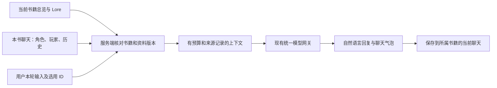

# 模块三重规划：本书资料与角色扮演聊天

日期：2026-10-06。状态：**暂缓**。用户随后明确模块三目前够用、不作大改；本聊天重设计保留为历史建议，任务卡不执行。当前只继续本书资料入口与模块三知识接入，见 `LEGACY_LORE_BOOK_CONTEXT_DATAFLOW.md` 顶部现行范围。

本方案接替 `LEGACY_LORE_BOOK_CONTEXT_DATAFLOW.md` 第 17 节的模块三运行方案；其中旧素材的只读、确认采用和数据归属原则继续适用。模块四及其它模式不在本次改造范围内。

## 1. 用户已经确定的方向

- 模块三读取当前书籍资料库中的知识。换一本书，就换一套冒险背景与角色。
- 页面和操作也改成聊天式：角色头像、左右对话气泡、聊天记录、底部输入框，不只替换资料注入。
- 保留已经接通的统一模型 API 与平台 Settings，不再建立模块三自己的密钥或连接设置。
- 书架的「和 AI 一起构思」入口继续移除；保留其底层 API 不代表恢复该入口。
- 先做电脑端。此次不安排手机适配。
- 保护原有书籍、资料、旧冒险、其它 AI 的未提交改动；不自动迁移、不删除存档。

建议的产品定义：**书籍管世界设定，聊天管本场剧情。** 一本书可以有多份聊天；切书后恢复那本书的最近聊天，也可以开始一份新聊天。切书本身不产生模型调用。

## 2. 当前事实与目标之间的差距

2026-10-06 核对正式维护树 `D:/Narraverse2.0-platform-model`，分支 `codex/platform-model-unification`，HEAD `95acac709bbb269e5612467712886022266160bd`。工作树有其它任务的未提交改动，实施时必须重新盘点。

| 当前已核对能力 | 本次需要改变的部分 |
| --- | --- |
| 正式 8084 提供的 `/narraverse/app.js` 与维护树 `app/app.js` SHA-256 相同；存在 `backgroundBooks`、`syncMeta`，没有 `bookBound` | 旧冒险的背景书副本及同步机制不能当作当前书籍 Lore 已接通的证明 |
| `buildLorebookBlock(adventure)` 读取冒险的 `backgroundBooks`，角色来自 `characterCards` | 新聊天改读服务端核实过的当前书籍 Lore；不继续复制私人背景书作为第二份设定 |
| 已有 `msg-bubble` 等样式，但 `renderStory` 仍按回合和叙事/批注栏组织 | 重新设计聊天列表、头像、消息宽度、输入和操作，不以调圆角作为完成 |
| `buildTavernSystemPrompt` 仍强制 `[NARRATIVE]`、`[STATE]`、`[CHANGES]`、`[CHOICES]`、任务等区块 | 新聊天默认自然语言与 Markdown，不要求每轮返回数值状态、任务或选项 |
| 模块三/四共享宿主模型链路；目前 bind 包含独立 world/library 选项 | 新增模块三专属的本书上下文分支，保留鉴权与模型路由；不改模块四消费行为 |
| Lore 已有稳定条目 ID、Enabled、Keywords、LoadMode、图片和关系；支持 resident/auto/manual | 复用这些字段；主次人物、置顶和加载方式仍是不同概念 |
| 旧冒险主要保存于 IndexedDB，并有 localStorage 镜像 | 新聊天持久化归属于书籍工作区，换端口或刷新不应变成另一套聊天资料 |
| 现有酒馆角色卡导入可以产出 Lore，并保存 `setting/interactive-openings.json` | 复用解析和开场素材；不能将单一书籍封面误认成每个角色的头像，也不猜开场与角色的绑定 |

以上是源码及在线静态资产核对，不是新方案已完成验收。根树中的旧 P1 书籍接入实现只能作参考，不能整体覆盖正式维护树。

## 3. 路线选择

| 路线 | 最有力的理由 | 主要代价 | 建议 |
| --- | --- | --- | --- |
| **独立模块三聊天工作区，复用平台资料与模型服务** | 可直接跟随平台书籍状态，清楚分离聊天与设定；不会继续被旧冒险的状态协议牵制 | 需要补齐聊天持久化和一个新的页面消费链 | **采用** |
| 在旧 iframe 上接本书资料并改气泡 | 能较快做出初步外观，旧交互可以直接复用 | 书籍、浏览器存档、旧背景副本与运行状态继续混在大脚本里，切书和恢复更难收口 | 可作行为参考，不作为新长期默认 |
| 直接嵌入一套完整 SillyTavern | 可以得到成熟的完整酒馆生态 | 多一套服务、角色库、聊天存储和连接配置；与本平台资料归属需要另做同步 | 此轮不选 |

推荐在 Denova React 前端增加模块三专用聊天工作区，沿用平台书籍切换、主题、资料入口与统一模型服务。模块四继续使用自己的既有消费路径；旧 iframe 及旧冒险保留为兼容入口。这里只替换模块三的默认使用方式，不重写其它模块或整个平台。

参考 SillyTavern 的角色、玩家身份、聊天与世界资料组织方式，而不是一次复制插件市场、脚本、任意提示词注入和所有高级选项。

## 4. 桌面页面与聊天行为

```text
平台导航保留    当前书籍 ▾   当前聊天名称       AI 扮演：角色 / 叙事者    本书资料
             ┌──────────────┬──────────────────────────────────────────┐
             │ 新聊天       │  角色头像 角色名                         │
             │              │  ┌─────────────────────────────┐         │
             │ 本书聊天列表 │  │ “今晚别去第七灯塔。”         │         │
             │              │  │ *他压低声音，望向窗外。*     │         │
             │ 最近一场     │  └─────────────────────────────┘         │
             │ 灯塔夜谈     │             ┌─────────────────────────┐  │
             │ 另一种开局   │             │ 我想先看看那把钥匙。     │  │
             │              │             └─────────────────────────┘  │
             │ 更多 →旧冒险 │                              玩家头像   │
             ├──────────────┤                                          │
             │ 我扮演谁     ├──────────────────────────────────────────┤
             │ 模型连接状态 │ 输入对话或行动……                 发送    │
             └──────────────┴──────────────────────────────────────────┘
本书资料/角色/本轮记忆打开右侧抽屉；主区域始终是聊天。
```

布局默认：AI 在左、玩家在右，显示头像与名字；长回复使用较宽气泡和自然换行，主阅读宽度约 760—960px，文字 16—18px。右栏默认收起，在较窄的电脑窗口仍保证聊天宽度。统一平台深浅主题，保留低饱和表面与清楚的文字对比度，不再堆回合批注、仪表和战斗面板。

第一版检验 1366×768、1440×900、1920×1080。模型正文渲染经过安全处理的 Markdown；动作描述、引号和段落保持可读，不执行角色卡或回复中的 HTML 脚本。

| 区域 | 聊天版目标内容与操作（B 为可用核心，C1 补消息操作） |
| --- | --- |
| 左侧 | 本书聊天列表、新聊天、继续上次聊天、玩家身份、更多中的旧冒险 |
| 顶栏 | 平台当前书籍、聊天标题、当前 AI 扮演对象、本书资料入口；不另建一个独立书籍选择状态 |
| 消息区 | 玩家/角色/叙事者的头像和名字、气泡、保存或失败状态；不要求数字战斗或每轮三选一 |
| 底部 | 多行输入、发送、生成期间停止；Enter 发送、Shift+Enter 换行，中文输入法选词不触发发送 |
| 右侧按需打开 | 本书人物、资料选用、本场记忆、本轮资料来源；编辑资料打开既有资料详情 |
| 末条消息操作 | 编辑最近消息、重新生成、续写、候选版本切换；较早消息的分支编辑放后续 |

候选版本保留原回复，只有当前选中的版本进入后续上下文。续写明确追加到末条回复。编辑、改选候选或续写后，旧摘要不能继续当作有效记忆；需要核对摘要依据并失效重建。

SillyTavern 官方把 Bubbles 定义为聊天气泡显示方式；角色开场语与示例对话也会影响回复风格。本项目将这些体验与本书资料结合，具体布局采用上面的桌面设计。[UI Customization](https://docs.sillytavern.app/usage/core-concepts/uicustomization/)、[Character Design](https://docs.sillytavern.app/usage/core-concepts/characterdesign/)

## 5. 开始一场聊天：角色卡仍然有用

从模块三进入本书时，默认恢复上次聊天。没有聊天时显示「开始聊天」，只需选择 AI 扮演对象和自己的身份；地点、开场和语气是可选项，不再经过新建冒险的主题、职业、属性配置流程。

AI 有两种首版选择：

1. **角色聊天**：从本书人物选择一个角色，人物正文每轮参与上下文，头像取该人物已关联的图片；未设置图片时显示名字占位。
2. **叙事者**：AI 扮演世界中的人物并叙述环境，适合自由探索；用户可显式选本场主要人物。多个角色在同一段叙事中发言，不伪装成已经实现的独立多 Agent 群聊。

「我扮演谁」与「AI 扮演谁」分开。玩家可以引用本书某人物，也可以填写本场的名字与简短身份；自定义玩家信息只属于当前聊天，不自动成为书籍新人物。SillyTavern 的 Persona 同样表示用户参与聊天时采用的身份。[Personas](https://docs.sillytavern.app/usage/core-concepts/personas/)

人物知识继续从 Lore ID 读取，不复制成可单独编辑的 characterCards 正文。开场语、示例对话、说话风格等属于角色扮演参数，建议先以本书的模块三元数据引用 Lore ID 保存；不额外存一份人物背景。第一版可直接使用已有正文，无这些附加字段也能聊天。

已有 `interactive-openings.json` 可作为本书开场候选。未明确归属某角色的开场，由用户选择，不按名称自动关联；没有开场时允许玩家直接发第一句。选择书籍、角色、已有开场均不自动调用模型；「生成开场」若后续提供，必须是明确操作。

角色卡导入复用现有解析：设定和世界书内容确认后进入 Lore，开场和示例对话按实际可保留的字段处理。卡片中的 system/post-history 覆盖等高级指令不默认变成宿主权限。本期先消费已经在书中的资料，不扩张到全部卡片格式与插件兼容。

## 6. 谁保存什么

| 数据 | 唯一归属与写入规则 |
| --- | --- |
| 书籍总览 | 本书 `setting/book-overview.md`；沿用已有保存与 revision 检查 |
| 人物、地点、规则等设定正文与图片 | 本书 `.denova/lore/items.json` 及其既有资产；聊天只读，资料编辑仍走 Lore 服务 |
| 角色扮演附加参数 | 建议本书 `.denova/narraverse/role-profiles.json`，以 Lore ID 关联；只存开场/示例/语气等，不复制人物事实 |
| 聊天、玩家身份、本场场景、选用资料、回复候选、摘要 | 建议本书 `.denova/narraverse/chats/<chat-id>.json`，版本化格式与 revision；与写作 Agent 会话及游戏 Story 存储分开 |
| 当前聊天指针 | 本书的模块三偏好；可校验恢复，不能拿别书指针当当前会话 |
| 旧冒险 | 原 IndexedDB/localStorage 原样保留；不随新聊天清空或自动认领 |

存储路径是拟定契约，开工前核对已有路径并冻结；不用新数据库作为前置。聊天首版采用单文件原子保存与 CAS，列表从聊天记录派生，避免同时维护两份可冲突的聊天事实。可复用已有文件保存和 ID 校验工具，不直接把写作工具会话或游戏 Story 当作模块三存档。

资料库重设计仍由 `BOOK_LIBRARY_REDESIGN_2026-10-06.md` 管理。其人物分层、图片、档案和图谱由模块三引用，不重复开发。后续若统一角色档案字段，再按冻结契约做明确适配；本期不要求资料库 R1—R4 全部完成才可以聊天。

聊天可以创造新的剧情，但新剧情只进入本场记录。将人物关系或新事实收录到资料库必须另经用户确认。本场摘要不是本书总览，主次人物分组不是注入优先级，置顶不是常驻。

## 7. 每轮如何使用本书知识



建议首版装配顺序：通用角色扮演规则 → 已保存总览 → 启用的常驻规则 → AI/玩家引用的角色 → 本场场景与明确选用 → 自动命中条目 → 有效摘要、最近历史及本次输入。示例对话只在预算允许时加入。

### 加载规则

- `Enabled=false` 的条目不注入。当前主角色被删或禁用时明确提示重新选择，不能偷偷换角色。
- `resident` 每轮加载；`manual` 仅在明确选用时加载；`auto` 可按本轮输入及最近聊天匹配。
- 自动匹配首版采用确定性的名称与 Keywords 触发，建议默认扫描最近 6 条消息，包含本次输入；通用 Tags 不默认作为触发词，避免「人物」「重要」之类标签把整库拉入。
- 同一 ID 去重。条目既常驻又被选为角色，只发送一份正文，同时保留两个选用原因。
- 未知/失效的普通选用 ID 不注入，并在资料来源里提示；不按同名去别书找替代条目。
- 没有总览也可使用人物、常驻和选用资料；空书显示资料为空，不回退旧冒险背景、静态示例世界或未选独立库。

SillyTavern World Info 支持关键词触发、扫描深度、常驻与预算。本项目第一版采用可解释的关键词机制；递归触发、向量检索、概率触发等不作为接通前置。[World Info](https://docs.sillytavern.app/usage/core-concepts/worldinfo/)

### 预算与可见依据

预算使用统一模型配置的上下文限制，并预留输出空间；`max_tokens` 不能被误当成模型总上下文大小。无法读取限制时显示并要求设置明确的输入预算，不猜测上游模型容量。建议可选资料先限制在剩余输入预算的一部分，并优先保留角色、常驻、明确选用、本次输入与必要历史。

可选自动条目超预算时按稳定顺序减少，并显示未采用原因；必需内容已经超限时提示减少资料或使用明确摘要，不静默丢掉输入或关键规则。没有可靠 tokenizer/usage 时只报告估算字数或估算 token，不伪造计费值。

「本轮资料」展示：来源书籍、实际使用的条目及原因、资料版本、被排除原因和预算估计。界面依据服务端实际装配回执，而不是客户端勾选列表。正文可在本机详情里查看，普通诊断日志只记 ID/版本/原因，避免将用户整库正文写进日志。

### 调用与写入边界

新模块三请求引用聊天 ID、base revision、request ID、动作、输入和选用条目 ID；书籍路径由服务端从当前受控工作区派生。角色、场景与历史从所属聊天记录读取，客户端不提交可信的跨书路径或第二份 Lore 正文。

沿用宿主鉴权、绑定和 `App.GenerateModel(module=narraverse)`；模块三会话服务负责准备和保存，网关仍只负责模型调用。按 consumer 添加模块三分支，不能全局让模块四读当前书。现有 bootstrap/Origin/cookie 要求继续保留，不用放宽鉴权解决接入问题。

当前网关是一次性调用。首版明确显示等待、失败与可重试，不承诺已经支持逐字流式；停止至少取消本场请求并阻止迟到写入，上游不响应取消时也不得保存作废结果。流式输出可在完整链路稳定后单独增加。

生成前保存当前输入及请求归属；失败保留输入并标记失败，重试不重复追加用户消息。相同 request ID 幂等，不因为连点产生两次生成。完成时核对书籍、聊天 revision 和生成令牌后再原子保存回复。

## 8. 切书、切聊天与资料变更

1. A 书只显示 A 的聊天、角色及资料。切到 B 书时加载 B 的最近聊天；无聊天则显示开始入口，不自动生成开场。
2. 切书立即递增序号令牌，失效旧绑定、缓存和在途操作。A→B→A 的 A₁ 回复不能被误认成新的 A₂ 请求；目录加载、清理 loading、模型回复和保存都要检查令牌。
3. 同书切聊天也必须核对 chat ID 与 revision；不能只检查书名或工作区相同。
4. 旧书未发出的输入按原聊天保留草稿；无法保存时明确提示，不把草稿带到新书输入框，也不静默丢弃。
5. 切书取消本轮请求，服务端标记 generation 作废；迟到模型回复不渲染、不保存。回到原书看到已保存聊天及失败/取消状态，可以明确重试。
6. 同书修改 Lore 后，新一轮读取新版本。`book_stale` 可在尚未启动上游调用、仍属同书同聊天时重绑一次；已经发起模型调用不自动再次付费重试。`book_changed` 停止原请求，不拿新书内容重试旧输入。
7. 刷新恢复先核对书籍和聊天归属。当前书不可访问时给出返回书架或修复路径入口，不自动接到另一书上。
8. 书籍身份沿用现有规范化工作区路径，显示名不作身份；既有书籍重命名/移动流程的影响在开工契约中核对，不引入第二套书籍注册表，也不按同名猜归属。

本期仍允许用户明确进入独立作品设定库的旧功能，但新「本书聊天」不会将它隐式混注。跨书或跨库资料必须经过可见的确认采用流程进入目标书。

## 9. 旧冒险的处理

- 更多菜单保留「旧冒险」，标注「旧资料来源」。原数据与原模型行为保留，不让切书自动认领它。
- 新默认聊天不用旧 `buildTavernSystemPrompt`/结构解析器，不以隐藏 `[STATE]` 等标签来假装更换了生成格式。
- 旧冒险改为新体系是后续显式导入：用户选择原存档和目标书、查看资料预览并确认；原件和旧会话始终保留。
- 设定/人物与游玩历史分别导入；历史不默认作为长期 Lore。已有同名资料按稳定 ID 和来源处理冲突，不覆盖原书条目。
- 首个可用版不承诺所有旧卡片、分支、数值、任务可以无损转换成新聊天。兼容入口使它们仍可使用，不以批量迁移作为上线条件。

## 10. 实施任务卡与顺序

下列任务尚未派发。每包开工前记录维护树、分支、基准 SHA、已有改动归属；只改所列范围。文档根树和发布快照不得作为代码真源。阶段 B 全部完成前只做隔离预览，不替换正式默认入口。

| 任务 | 交付内容 | 可验收条件 | 主要范围与依赖 |
| --- | --- | --- | --- |
| A0 桌面聊天预览 | 用虚构的一本书、两个人物、两份聊天展示气泡、头像、输入和资料抽屉 | 三个电脑尺寸可读；长消息/空态/深浅主题可见；明确标为虚构预览，不声称资料链已通 | 独立 artifacts 预览；约 2—3 文件；无 API、用户数据或正式部署 |
| B0 冻结契约 | 确认书籍身份、聊天格式、CAS、角色引用、绑定和回执；与资料工作台 R0 对齐 | 一份样例涵盖两书、同书两聊天、失效 ID、超预算；模块四 DTO/行为边界清楚 | 本计划与少量契约样例；无数据迁移 |
| B1 聊天保存接口 | 新建、列出、读取、保存本书聊天；服务器校验归属 | 独立两书及同书两会话不串；保存/刷新相同；旧 revision 拒绝且内容不丢 | 新域 types/store/test、handler、routes；约 5 文件；依赖 B0 |
| B2 页面接真实聊天 | 把 A0 布局接 B1，选择已有 Lore 人物/玩家，恢复与新建聊天 | 真实浏览器新建→输入草稿→保存→刷新恢复；切换本书聊天；没有原回合/战斗布局 | 模块三新 workspace/API client/i18n/定向测试；按组件拆包，每包约 3—5 文件；依赖 A0/B1 |
| B3 服务端本书上下文 | 总览、resident、角色/明确选用、auto 关键词、预算与实际来源回执 | 上游记录确含选中独有事实；禁用/手动未选/旧背景均不出现；空书不回退；生成不改 Lore | 模块三 context/service/test、host 专属分支、handler；每包约 3—5 文件；依赖 B0/B1 |
| B4 生成与切书闭环 | 页面发送走统一模型链，服务端保存；取消、幂等、revision 与 A→B→A 保护 | A 生成/刷新→B 新聊天→返回 A 继续；A₁ 迟到无污染；失败重试不重复用户消息；模块四消费回归不变 | workspace 生成控制、会话 commit、绑定生命周期、定向反例；依赖 B2/B3 |
| C1 角色聊天体验 | 角色开场/示例、末条编辑、回复候选与续写 | 开场/人设生效；候选保存刷新仍在且只用当前版本；编辑后失效摘要不串入 | 角色参数、消息操作、定向测试；按行为拆成约 3—5 文件的小包；依赖 B4 |
| C2 显式旧冒险采用 | 为愿意迁移的用户提供选原件、选目标书、预览确认流程 | 原件哈希保留；取消不变；选定资料入目标书且不误写历史事实 | 后续独立任务，不与首个可用版绑定 |

A0 优先让用户看样式；B0—B4 是第一个可以实际玩的版本；C1 补足更接近酒馆的日常操作。C2、群聊、多 Agent、向量检索、递归资料触发、任意脚本、移动端和模块四改造不纳入首版。

模型分工：性价比编码 AI 负责 A0、冻结契约后的页面接线/翻译和已有断言的回归；具备复杂推理能力的实现者负责 B0/B3/B4 的所有权、预算和竞态。A 主审维护最终契约并整合，Luna 可作独立定向复核。共享 host/routes 与同一组件的修改按依赖串行，不让多个 AI 同时改。

## 11. 验证与收口

每阶段只做与风险匹配的检查，失败修复后复跑对应反例；通过后不重复扩张验证。

- 固定桩：抓真实宿主/路由装配给上游的输入，钉住常驻+选定+关键词命中、禁用与空书、同 ID 去重、预算来源回执；钉住 A→B→A、同书切聊天、失效 revision 和重试幂等。
- 真实浏览器：桌面气泡→选本书角色/资料→生成→刷新恢复→切书→返回续聊。未拦截接口的页面验收与桩上游输出分别报告；沿用系统浏览器 bootstrap，不能用裸标签或放宽鉴权冒充真实连接。
- 真实模型：实际调用前说明次数并使用已授权的共享模型，验证角色与选中条目的独有事实；单独标注结果，不用 build/status/HTTP 200 代替生成质量。
- 回归：模块四原有 host/model 消费链、普通新建书籍、Lore 编辑与图片保留、旧冒险可打开；不因此安排无关的全仓重构或压力测试。
- 发布前核对本次构建/数据/端口的精确归属。阶段验收通过后停止加测，正式替换另按用户部署授权执行。

完成判据：用户能在 A 书选角色，用本书知识进行气泡聊天；刷新仍在；切 B 玩另一场；返回 A 继续；全过程不混入旧背景、不改写资料库、不改变模块四行为。

## 12. 本轮交付状态

已完成：现状定位、SillyTavern 官方文档核对、聊天 UI 与资料/会话归属设计、候选路线取舍及实施任务卡。

未执行：功能代码、界面原型、模型调用、测试构建、数据迁移、服务启停和正式部署。此文是待审阅方案，当前 8084 页面仍是原实现。
